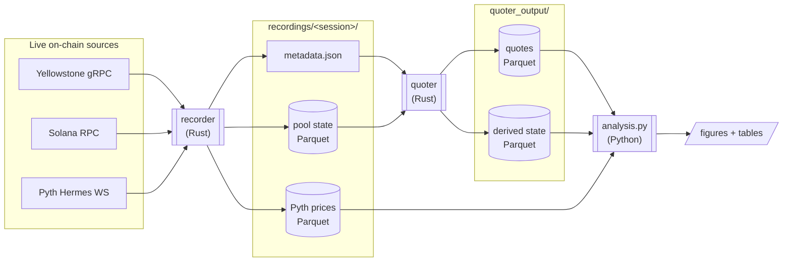

# propamm-replay

Record live Solana AMM state, replay it offline to compute swap quotes, and
analyze execution quality — a research toolkit for studying proprietary AMMs
("pAMMs") against Pyth reference prices.

## What it does

The pipeline has three stages, each a small dedicated tool:

| Stage       | Tool                  | Role |
|-------------|-----------------------|------|
| **Record**  | `recorder` (Rust)     | Subscribes to pool accounts on a Yellowstone gRPC stream and writes raw account state to Parquet, alongside Pyth reference prices. |
| **Quote**   | `quoter` (Rust)       | Replays a recorded session through protocol-specific AMM math and computes swap quotes at fixed USD size tiers. |
| **Analyze** | `analysis.py` (Python)| Turns quotes + prices into figures (PDF) and tables (CSV): spreads, PnL, market share, slippage. |

Supported AMM protocols: `humidifi`, `raydium_clmm`, `orca_clmm`, `alphaq`,
`bisonfi`, `solfiv2`, `goonfi`, `tesserav`, `zerofi`.

## Architecture



- **recorder** bootstraps initial account data over RPC, then streams account
  writes from gRPC into one Parquet directory per pool, snapshotting all
  accounts every 30 s. Pyth prices stream in parallel.
- **quoter** loads a session, picks a protocol implementation per pool (the
  `ProtocolReplay` trait), replays updates in `(slot, write_version)` order,
  and emits quotes once per slot. Pools are processed in parallel.
- **analysis.py** consumes the Parquet output and renders thesis figures.

## Quick start (Docker)

**Prerequisites:** Docker with Compose v2. Recording also needs access to a
Yellowstone gRPC endpoint (and an RPC URL for the initial account bootstrap).

```bash
# 0. (optional) set defaults — gRPC endpoint, RPC URL, duration
cp .env.example .env && $EDITOR .env

# 1. Build the image: compiles both Rust binaries + installs the Python stack
make docker-build

# 2. Record a session — output lands in <RECORDINGS_DIR>/<session-id>/
GRPC_ENDPOINT=http://127.0.0.1:10000 DURATION=1h make docker-record

# 3. Replay the session into quotes
make docker-quote SESSION=<session-id>

# 4. Generate analysis figures + tables
make docker-analyze SESSION=<session-id>
```

`<session-id>` is the timestamped folder name created under the recordings
directory (e.g. `2026-05-19T10-47-01Z`).

Every container mounts the same host directory, **`RECORDINGS_DIR`** — default
`/var/solana/data/recordings`, the same location the native `make record`
targets write to. Override it (env var or `.env`) to use another path, e.g.
`RECORDINGS_DIR=./recordings make docker-record`. The `docker-*` Makefile
targets run the container as your host user, so written files are not
root-owned.

### Using `docker compose` directly

The Makefile targets are thin wrappers — equivalent raw commands:

```bash
docker compose build recorder                       # build the shared image
docker compose run --rm recorder                    # record
SESSION=<id> docker compose run --rm quoter          # quote
SESSION=<id> docker compose run --rm analyzer        # analyze
```

You can override the command for advanced runs — custom size tiers, or the
cross-pool route analysis:

```bash
docker compose run --rm quoter \
    quoter quote --session /data/recordings/<id> --tiers 1,10,100,1000
docker compose run --rm quoter \
    quoter route-analysis --session /data/recordings/<id>
```

> The `recorder` service runs with host networking, so `GRPC_ENDPOINT`
> reaches a validator / gRPC stream bound to `127.0.0.1` on the host. Point
> it at a remote endpoint if your stream lives elsewhere.

## Output layout

```
$RECORDINGS_DIR/<session-id>/
├── metadata.json                session + pool descriptors
├── pools/
│   ├── SOL-USDC_2fynS3sP/        raw account-state Parquet (one dir per pool)
│   └── pyth_prices/              Pyth reference-price Parquet
├── quoter_output/<pair>/         computed quotes + derived state Parquet
└── analysis/                     figures (PDF) + tables (CSV)
```

## Pool configuration

Each file in `pools_sol_usdc/` describes one pool the recorder subscribes to:

```json
{
  "type": "zerofi",
  "id": "2fynS3sPcG3u6sq7TJtvncgoRVS5kVJwT6x8JMzDWeX8",
  "symbol": "SOL-USDC",
  "accounts": {
    "base_vault": "CvKXXfxq2YzgQ9V7PBfNCzFmRSrj1VX49tjAJqJy68AU",
    "quote_vault": "fEe1SXYGDYGY7c7ttEY2Jyffzotx12heiw8xdrctvi1",
    "extra_a": "8943FQrCirbp2kNk8cVKS5P7vjNzhas3L9fDoqpnv8mw"
  }
}
```

A Pyth reference feed uses `type: "pyth"`:

```json
{ "type": "pyth", "feed_id": "0xef0d8b6f...", "symbol": "SOL/USD" }
```

To track a new pool, drop a JSON file into `pools_sol_usdc/` — no rebuild
needed, the directory is bind-mounted into the recorder container.

## Running natively (without Docker)

Requires Rust (stable toolchain), `protobuf-compiler`, and Python 3.12+ with
the packages in `requirements.txt`.

```bash
make build                                          # cargo build --release
make record-1h                                      # or record-8h / record-12h
make quote   SESSION=/var/solana/data/recordings/<id>
make analyze SESSION=/var/solana/data/recordings/<id>
```

## Project layout

```
recorder/            Rust crate — live gRPC capture → Parquet
  src/grpc.rs          Yellowstone subscription
  src/pyth.rs          Pyth Hermes price stream
  src/writer.rs        per-pool Parquet writers
quoter/              Rust crate — offline replay + quote computation
  src/engine.rs        per-pool replay loop
  src/route.rs         cross-pool route analysis
  src/protocols/       one module per AMM (ProtocolReplay trait)
scripts/analysis.py  figures & tables for the thesis evaluation
pools_sol_usdc/      pool + Pyth feed configs
Dockerfile           multi-stage build (Rust binaries + Python stack)
docker-compose.yml   record / quote / analyze services
Makefile             native + Docker task shortcuts
```
